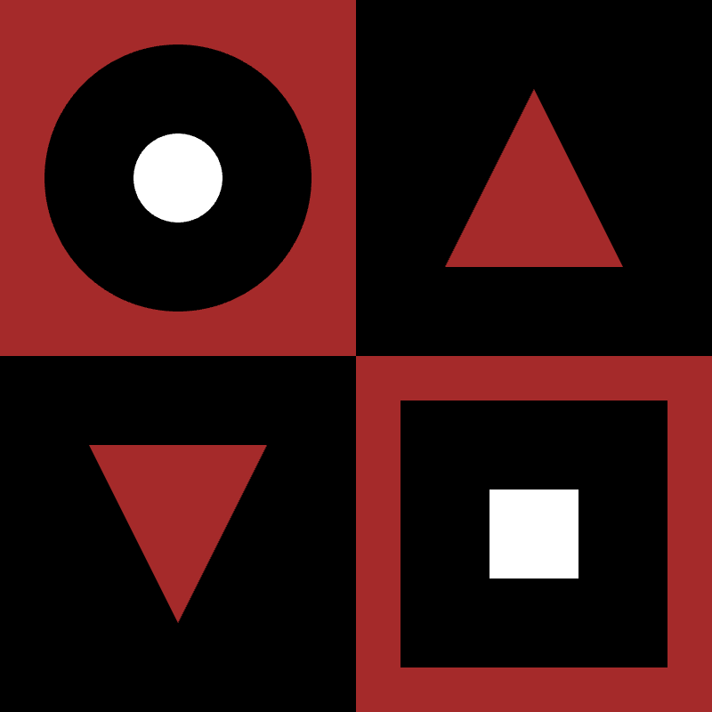

# TITLE OF PROJECT

Chloe Tso

## Description

This project showcases my prototype for an abstract drawing. It consists of various shapes: squares, circles and triangles to create different patterns within a 2x2 grid. Below is an image of my work:

## Attribution

This bit attributes my code:

> - This project uses [p5.js](https://p5js.org).

## License
> This project is created by Chloe Tso in regards to her CART 253 instructions prototyping project.