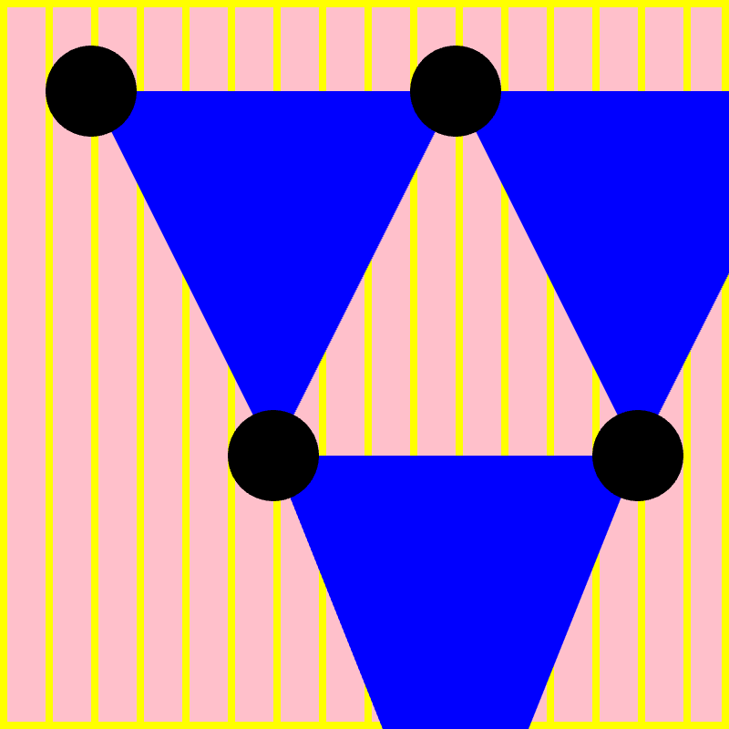

# TITLE OF PROJECT

Chloe Tso

## Description

This project displays my weird prototype that involves manipulation of shapes. It consists of a yellow line pattern background, black circles and blue triangles to form an abstract appearance.

## Attribution

This bit attributes my code:

> - This project uses [p5.js](https://p5js.org).

## License
> This project is created by Chloe Tso in regards to her CART 253 instructions prototyping project.