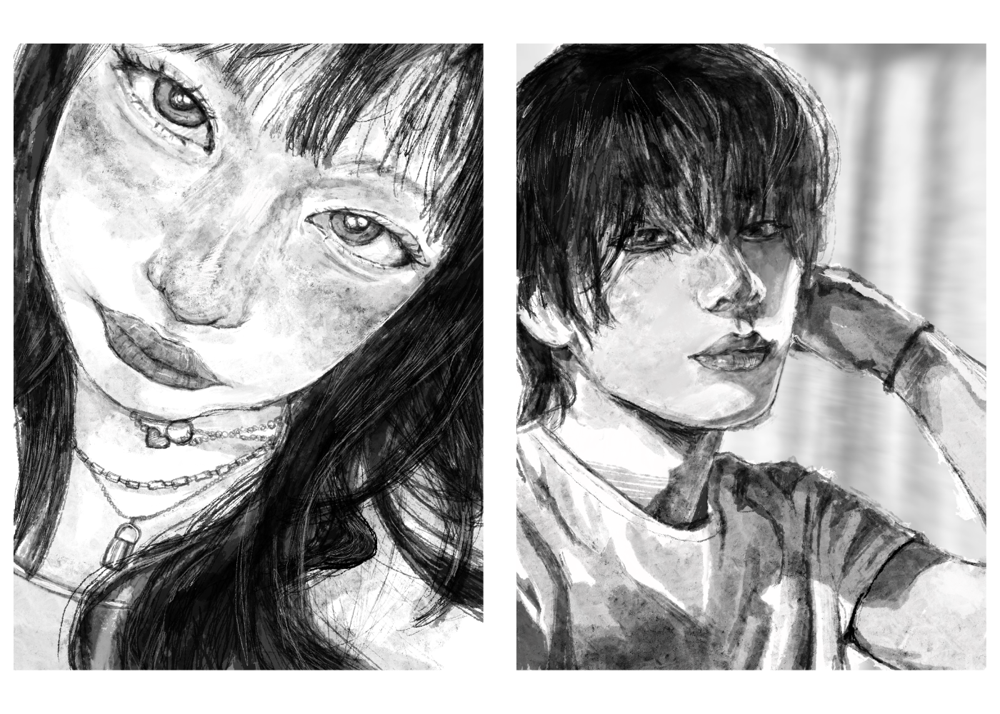

# Chloe's Website

Welcome to my course website!

## Description of Website

This website provides documentation of my prototyping work in CART 253. It showcase features a variety of interactive projects, experiments and creative experiments. 

> *The Mayor of Clown Town* is a simulator experience that allows the user to control a small town populated entirely by clowns.

## My Personal Work Examples

Here are some examples of my personal works! I particularly enjoy exploring different creative mediums!!

  

## Quick Links
* [Read my reflective journal](journal.md)

## Attribution

This bit should attribute any code, assets or other elements used taken from other sources. For example:

> - This project uses [p5.js](https://p5js.org).
> - The clown image is a capture of the clown from the Apple emoji character set.
> - The barking sound effect is "single dog bark 1" by crazymonke9 from freesound.org: https://freesound.org/people/crazymonke9/sounds/418107/

## License

This work is produced by Chloe Tso as part of CART 253's coursework.

> This project is licensed under a Creative Commons Attribution ([CC BY 4.0](https://creativecommons.org/licenses/by/4.0/deed.en)) license with the exception of libraries and other components with their own licenses.