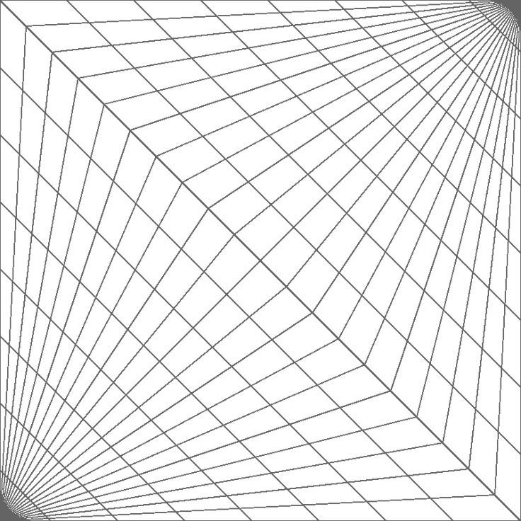

# MY REFLECTIVE JOURNAL

## 14/09/2026 - Prototyping my website
  
Through this project of creating a website using Markdown and Github, I learnt firsthand how effective both tools can be Surprisingly, I found Markdown incredibly useful, as it avoided the complicated syntax that HTML has. Additionally, I particularly liked how easy and readable Markdown code is, allowing even beginners to follow. 

Regarding Github, I found it challenging to navigate the platform. There were issues in setting up my repository as I found it confusing having to connect github.com with Github Desktop. After multiple rounds of trial and errors, I was able to start hosting the website successfully. Nevertheless, I believe this platform is really efficient at website publishing, given the simple steps of just pushing the changes to Github. This tool will significantly boost productivity and optimize the performance on the whole process of creating a website. 

This website acts as the home of my artwork collection, and I hope it allows the future audience to resonate with the range of emotions I showcase through my work. I am planning to build projects that explore abstract ideas, specifically through shape configuration and colour palettes. Moreover, I hope by the interaction to this webpage, it evokes creative inspiration to others as well. 
   
   
   
## 22/09/2026 - Prototyping instructions

While making these prototypes, I was able to learn the basics of p5.js and utilise its features to create several drawings. As p5 is relatively simple to code in, I was able to grasp the overall syntax pretty quickly. This provided me opportunities to delve into more creative approaches, such as making line patterns through precision of the x-y axes. 

One dificulty I faced was finding ways to form unique shapes. One example is my abstract drawing: I had an idea of executing the same shapes but in different colours, forming depth into that specific grid. Initially it was quite challenging to discover the accurate sizing, but I eventually figured out you just had to subtract each size by an equal ratio. This ultimately led me to my final result. 

Through this project, I really enjoyed the exploration of shape manipulation, and would love to develop towards this style in the future. One example would be the image below (taken from Pinterest), where I can investigate more in lines to form 3D lookalikes.

