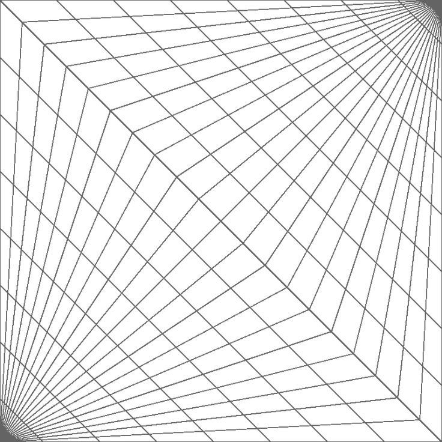
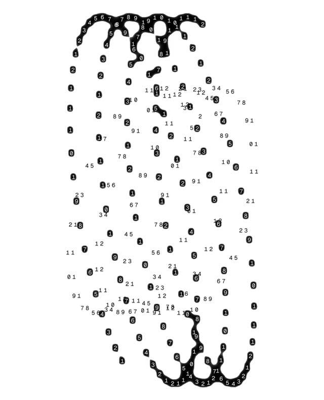
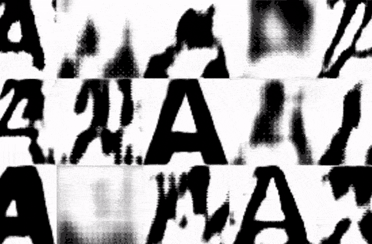

# MY REFLECTIVE JOURNAL

## 14/09/2026 - Prototyping my website
  
Through this project of creating a website using Markdown and Github, I learnt firsthand how effective both tools can be Surprisingly, I found Markdown incredibly useful, as it avoided the complicated syntax that HTML has. Additionally, I particularly liked how easy and readable Markdown code is, allowing even beginners to follow. 

Regarding Github, I found it challenging to navigate the platform. There were issues in setting up my repository as I found it confusing having to connect github.com with Github Desktop. After multiple rounds of trial and errors, I was able to start hosting the website successfully. Nevertheless, I believe this platform is really efficient at website publishing, given the simple steps of just pushing the changes to Github. This tool will significantly boost productivity and optimize the performance on the whole process of creating a website. 

This website acts as the home of my artwork collection, and I hope it allows the future audience to resonate with the range of emotions I showcase through my work. I am planning to build projects that explore abstract ideas, specifically through shape configuration and colour palettes. Moreover, I hope by the interaction to this webpage, it evokes creative inspiration to others as well. 
   
   
   
## 22/09/2026 - Prototyping instructions

While making these prototypes, I was able to learn the basics of p5.js and utilise its features to create several drawings. As p5 is relatively simple to code in, I was able to grasp the overall syntax pretty quickly. This provided me opportunities to delve into more creative approaches, such as making line patterns through precision of the x-y axes. 

One dificulty I faced was finding ways to form unique shapes. One example is my abstract drawing: I had an idea of executing the same shapes but in different colours, forming depth into that specific grid. Initially it was quite challenging to discover the accurate sizing, but I eventually figured out you just had to subtract each size by an equal ratio. This ultimately led me to my final result. 

Through this project, I really enjoyed the exploration of shape manipulation, and would love to develop towards this style in the future. One example would be the image below (taken from Pinterest), where I can investigate more in lines to form 3D lookalikes.

## 28/09/2026 - Prototyping variables
This prototyping project allowed me to explore a larger range of visual concepts from typography to shapes to incorporating illustrations. Variables taught me a lot about the significance of how code works, enabling me to explore more creative pathways towards these artworks.

A challenge I faced was incorporating the variable into my code. Initially, my typography movement used a sin graph, but I quickly figured it made the whole layout rather confusing. Hence, I changed to use multiple variables: an open time, hold time and close time. This quickly made the process simplier, as I only had to make open and close times the same duration for a seamless movement and transition.

What surprised me most was how a subtle shift in these numeric values led to a complete different change in each work. For example, changing the rectangle counts and frames per step heavily affected how the pattern shifting occured. 

I hope to explore more complex and abstract ideas in the future, such as possibly using variables to create moving 3D wireframes. Below attached is a project I really admire, and would love to develop my skills further to create something like this. 

## 08/10/2026 - Prototyping conditionals
Through prototyping using conditionals, I was able to learnt a lot on using phyiscal interaction to produce an artwork. Conditionals allowed me to explore how code respond to human input. For example for my 2nd prototype, by changing the cursor's position based the movement, I was able to utilize if statements to change the colour of the wireframe and background. 

One challenge I faced was for the pixel art game. Initially I was quite skeptical with how the logistics would work, especially for filling in a box colour. Therefore, I decided to try is mouseIsPressed, which allowed me to detect the mouse's interactions in order to fill that specific spot in with a fill colour. After discovering this function, I ended up using it for my last prototype too, and was able to explore sound effects as well. 

What surprised me the most was how easy and simple manipulating if statements was. The syntax of it allows a simplistic way for conditionals, and I find it very helpful in the process of learning it. 

As I quite enjoyed these prototypes, I hope to utilize more of what I learnt this lesson on conditionals, and include it in all my future works. One example is below, where I hope to change the text's texture based on the cursor movements.

